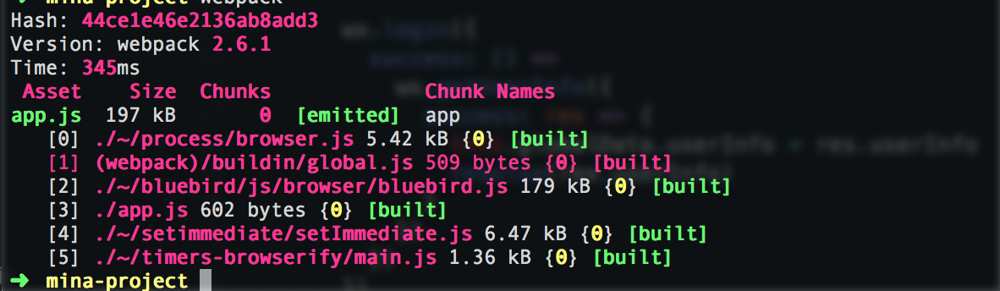

## webpack 起步

我们先进到 mina-project 文件夹的跟目录


初始化 npm
```
npm init
```
填完之后
安装 webpack
```bash
$ yarn add webpack -dev
```

新建 webpack.config.js

在 webpack.config.js 中写入代码


```javascript
const { resolve } = require('path')
const r = url => resolve(__dirname, url)
 
module.exports = {
  entry: {
    app: r('./app.js')
  },
  output: {
    path: r('./dist'),
    filename: '[name].js'
  }
}
```

>这里 entry 表示需要编译的文件, output 是编译之后的路径，'[name]' 对应 entry 中的 key，所以这个例子中 '[name]' = app

新建 app.js

写入代码
```javascript
//app.js
App({
  onLaunch: function () {
    //调用API从本地缓存中获取数据
    var logs = wx.getStorageSync('logs') || []
    logs.unshift(Date.now())
    wx.setStorageSync('logs', logs)
  },
  getUserInfo:function(cb){
    var that = this;
    if(this.globalData.userInfo){
      typeof cb == "function" && cb(this.globalData.userInfo)
    }else{
      //调用登录接口
      wx.login({
        success: function () {
          wx.getUserInfo({
            success: function (res) {
              that.globalData.userInfo = res.userInfo;
              typeof cb == "function" && cb(that.globalData.userInfo)
            }
          })
        }
      });
    }
  },
  globalData:{
    userInfo:null
  }
})
```

执行命令 webpack
```bash
$ webpack
```
这时候我们看到生成一个 `dist/app.js` 覆盖了原先官方 demo 的 app.js，所以我们现在的项目目录是(忽略 node_modules)

```javascript
├── app.js
├── dist
│   ├── README.md
│   ├── app.js
│   ├── app.json
│   ├── app.wxss
│   ├── ddd.cer
│   ├── pages
│   │   ├── index
│   │   │   ├── index.js
│   │   │   ├── index.wxml
│   │   │   └── index.wxss
│   │   └── logs
│   │       ├── logs.js
│   │       ├── logs.json
│   │       ├── logs.wxml
│   │       └── logs.wxss
│   └── utils
│       └── util.js
├── package.json
├── webpack.config.js
└── yarn.lock

5 directories, 17 files
```
<br>
让我们返回小程序开发者工具，并且刷新，可以看到 app.js 文件已经变成这样的了


<br>
这个 app.js 就是 webpack 打包后的一个文件

#### 引入 bluebird 将原工程 Promise 化

虽然小程序有 Promise，我们这里还是用 bluebird 作为一个引子，讲述一下使用 webpack 的基本方法，以及其实现模块化的方式

```bash
$ yarn add bluebird
```

在 app.js 中引入 bluebird 替代 Promise


```javascript
import * as Promise from 'bluebird'

App({
  onLaunch () {
    //调用API从本地缓存中获取数据
    var logs = wx.getStorageSync('logs') || []
    logs.unshift(Date.now())
    wx.setStorageSync('logs', logs)
  },
  getUserInfo () {
    return new Promise(resolve => {
      if (this.globalData.userInfo) resolve(this.globalData.userInfo)

      wx.login({
        success: () =>
          wx.getUserInfo({
            success: res => {
              this.globalData.userInfo = res.userInfo
              resolve(res.userInfo)
            }
          })
        })
      })
  },
  globalData:{
    userInfo:null
  }
})
```
<br>
修改 index.js
```javascript
//index.js
//获取应用实例

var app = getApp()

Page({
  data: {
    motto: 'Hello World',
    userInfo: {}
  },
  //事件处理函数
  bindViewTap () {
    wx.navigateTo({
      url: '../logs/logs'
    })
  },
  onLoad () {
    app
      .getUserInfo()
      .then(userInfo => {
        this.setData({
          userInfo:userInfo
        })    
      })
  }
})

``` 


```bash
$ webpack
```
我们可以看到表示已经成功了




