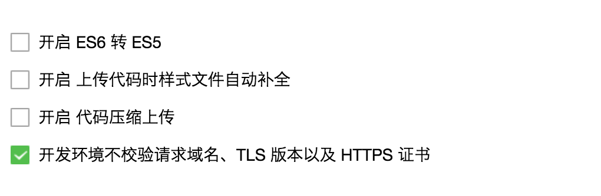

## 开发上的问题

### es2015

我们现在开始好奇微信小程序支不支持 es6 的语法，答案是肯定支持的。我们可以在开发者工具的源码中找到，小程序其实会对通过 `babel` 对小程序进行编译，但是可惜的是微信团队只配置 `babel-preset-es2015` 一个插件进去，这就意味着我们可以箭头函数、`Promise` 、`Class` 等等语法糖。但是我在默认模式下用不了 `Generator`。
如果想开启使用`Generator`，就要到开发者工具中，找到`项目`，拉到最底下，取消`开启 ES6 转 ES5 中`的勾选，这时候我还可以顺便勾选`开发环境不校验请求域名，TLS 版本以及 HTTPS 证书`



这个选项是为了后面我们请求服务器的时候可以直接使用 `http://localhost:3000`，而不需要找域名啊，内网穿透啊、内网映射什么的。

<br>

### async/await

由于 `async/await` 是`es7`中的语法，所以当然，我们是用不了的，这让刚体验到其简介的开发方式的我们不能忍啊。
<br>

### wxss

不得不说，对于一个优秀的前端来说，都2017年了你让他还使用 `css` 的语法，简直是对其的侮辱。
<br>

### 模块化

小程序官方是支持模块化的，并且依照 commonjs 规范来引用以及编写模块，但是我们在上一章也说了，小程序在初始化的时候会扫描项目目录下的 ``
.wxml
.wxss
.png
.jpg
.jpeg`
.gif
.svg
.js
.json
.cer``
所有文件（忽略 node_modules 文件夹），这就意味着假如我们想 require('regenerator-runtime')，或者require('./node_modules/regenerator-runtime') 等，都是行不通的，所以官方才会说
> 小程序目前不支持直接引入 node_modules , 开发者需要使用到 node_modules 时候建议拷贝出相关的代码到小程序的目录中。

<br>
### 我们的愿望
##### 先看下现在手头上有什么

- gulp、grunt等
- babel-cli、babel-core 等
- webpack2
- npm

##### 我们想要做什么

- 用上 `es7` 的新特性
- 样式文件用 sass 或 stylus 等
- 最好能像 vue 那样开发

##### 如何实现

`gulp`和`grunt`作为`前端自动化构建工具`虽然能实现我们想要的，但是有点重了，所以这里我们选用`npm` + `webpack` 方案。

##### 最终目标
通过
```bash
npm run dev
```
这样的命令，启动`webpack`以及其他一些服务，生成项目文件，并且监听。


