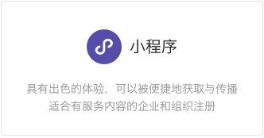
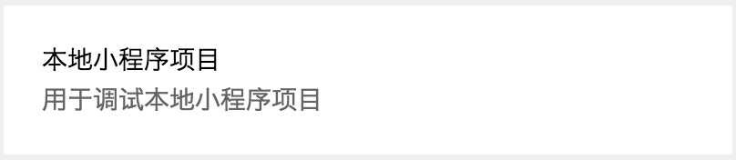
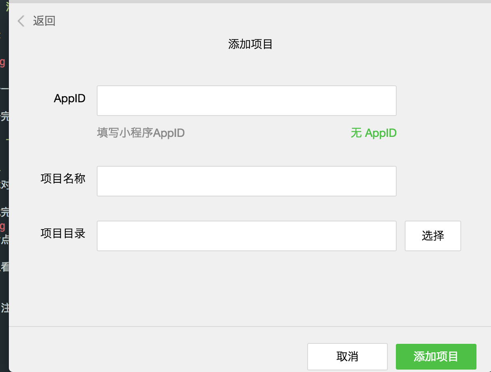

### 注册小程序（可跳过）

登录 [微信公众平台](https://mp.weixin.qq.com/) 点击`立即注册`按钮，选择

<br/>



注册一个小程序。

注册完毕之后登陆开发者平台，在`设置`-`开发设置`中可以找到你的AppID


<br>

### 下载开发者工具

打开 [小程序开发者工具下载页面](https://mp.weixin.qq.com/debug/wxadoc/dev/devtools/download.html) 下载对应你系统的开发者工具

下载完毕并安装之后，我们打开`开发者工具`选择



然后点击`添加项目`

可以看到



- 假如注册过了小程序的话，可以在 `AppID` 中填入 AppId,否则的话，可以点`无 AppID`,
- 项目名称可以随便填写

- 项目目录可以新建一个文件夹`mina-project`，然后再建一个子文件夹`dist`。项目目录就定位在`dist`文件夹

```
 mina-project/ 
 └── dist

```

配置完成之后点击`添加项目`，小程序会自动初始化一个简单的工程目录结构如下：

```javascript
└── dist
    ├── app.js
    ├── app.json
    ├── app.wxss
    ├── pages
    │   ├── index
    │   │   ├── index.js
    │   │   ├── index.wxml
    │   │   └── index.wxss
    │   └── logs
    │       ├── logs.js
    │       ├── logs.json
    │       ├── logs.wxml
    │       └── logs.wxss
    └── utils
        └── util.js

5 directories, 11 files
```

我们来看下微信官方对这些文件的介绍

``
点击开发者工具左侧导航的“编辑”，我们可以看到这个项目，已经初始化并包含了一些简单的代码文件。最关键也是必不可少的，是 app.js、app.json、app.wxss 这三个。其中，.js后缀的是脚本文件，.json后缀的文件是配置文件，.wxss后缀的是样式表文件。
``

<br>

#### app.js

我们先依次看下 `app.js`,`app.json`以及`app.wxss`文件中的内容

```javascript
//app.js
App({
  onLaunch: function () {
    //调用API从本地缓存中获取数据
    var logs = wx.getStorageSync('logs') || []
    logs.unshift(Date.now())
    wx.setStorageSync('logs', logs)
  },
  getUserInfo:function(cb){
    var that = this
    if(this.globalData.userInfo){
      typeof cb == "function" && cb(this.globalData.userInfo)
    }else{
      //调用登录接口
      wx.login({
        success: function () {
          wx.getUserInfo({
            success: function (res) {
              that.globalData.userInfo = res.userInfo
              typeof cb == "function" && cb(that.globalData.userInfo)
            }
          })
        }
      })
    }
  },
  globalData:{
    userInfo:null
  }
})
``` 

小程序开发者工具会用 `glob` 扫描项目目录下的所有文件夹的中的 `.js`、`.json`、`.wxml`、`.wxss` 文件（忽略 node_modules 文件夹），然后引入 `app.js` 以及 `app.json` 配置中 pages 数组中的对应目录下的 *.js，这里便是引入`pages/index/index.js`以及`pages/logs/logs.js`。

然后首先是通过 `App()` 函数注册程序，`onLaunch`作为生命周期函数，在小程序初始化完成之后会被触发，一般我们会将一些需要初始化的数据的事情放到这里面，例子中就是在 `Storage` 中写入日志。

`globalData` 作为一个全局的 object ，是为了让小程序中的数据可以在个个页面中相互调用。

`getUserInfo` 作为`other`函数添加进去
> 开发者可以添加任意的函数或数据到 Object 参数中，用 this 可以访问

<br>


#### app.json

```javascript
// app.json
{
  "pages":[
    "pages/index/index",
    "pages/logs/logs"
  ],
  "window":{
    "backgroundTextStyle":"light",
    "navigationBarBackgroundColor": "#fff",
    "navigationBarTitleText": "WeChat",
    "navigationBarTextStyle":"black"
  }
}

```
app.json 作为小程序的配置文件，其具体对应的配置可以在[官方说明](https://mp.weixin.qq.com/debug/wxadoc/dev/framework/config.html)找到。

<br>


#### app.wxss

```css
/**app.wxss**/
.container {
  height: 100%;
  display: flex;
  flex-direction: column;
  align-items: center;
  justify-content: space-between;
  padding: 200rpx 0;
  box-sizing: border-box;
} 

```
`app.wxss` 是小程序的一个全局样式文件，你可以把它看成 `app.css`，语法相同，只是文件扩展名改成了`.wxss`


<br>


### index 以及 logs

```javascript
├── index
│   ├── index.js
│   ├── index.wxml
│   └── index.wxss
└── logs
    ├── logs.js
    ├── logs.json
    ├── logs.wxml
    └── logs.wxss

2 directories, 7 files
```

pages 文件夹中的 index 以及 logs 作为页面对应 `app.json`中的`pages`，我们先来看 index 文件夹下的文件

#### index.js
```javascript
//index.js
//获取应用实例
var app = getApp()
Page({
  data: {
    motto: 'Hello World',
    userInfo: {}
  },
  //事件处理函数
  bindViewTap: function() {
    wx.navigateTo({
      url: '../logs/logs'
    })
  },
  onLoad: function () {
    console.log('onLoad')
    var that = this
    //调用应用实例的方法获取全局数据
    app.getUserInfo(function(userInfo){
      //更新数据
      that.setData({
        userInfo:userInfo
      })
    })
  }
})
```

`Page()`用来注册页面。`onLoad` 作为生命周期函数在页面开始加载的时候会被调用。`bindViewTap`是一个`other`方法。
而`data`就是用来存这个页面的初始数据。我们可以看到，在例子中当页面开始加载之后，会调用 `app.getUserInfo`(即 app.js 中的 getUserInfo)，将返回的数据写入 data.userInfo 中，并且是调用了 `setData` 因为只有通过 `setData` 触发页面上的数据更新。


#### index.wxml

```
<!--index.wxml-->
<view class="container">
  <view  bindtap="bindViewTap" class="userinfo">
    <image class="userinfo-avatar" src="{{userInfo.avatarUrl}}" background-size="cover"></image>
    <text class="userinfo-nickname">{{userInfo.nickName}}</text>
  </view>
  <view class="usermotto">
    <text class="user-motto">{{motto}}</text>
  </view>
</view>

```

`index.wxml`是小程序自己的一套标签语言，你可以把看做`html`标签语言的一种变体，或者说小程序一套自定义的`html`标签语言，
可以在官方[组件](https://mp.weixin.qq.com/debug/wxadoc/dev/component/)中查询每个组件的功能已经其属性和事件。

````javascript
audio: {
  "1.0.0": ["id", "src", "loop", "controls", "poster", "name", "author", "binderror", "bindplay", "bindpause", "bindtimeupdate", "bindended"]
},
button: {
  "1.0.0": [{
    size: ["default", "mini"]
  }, {
    type: ["primary", "default", "warn"]
  }, "plain", "disabled", "loading", {
    "form-type": ["submit", "reset"]
  }, "hover-class", "hover-start-time", "hover-stay-time"],
  "1.1.0": [{
    "open-type": ["contact"]
  }]
},
canvas: {
  "1.0.0": ["canvas-id", "disable-scroll", "bindtouchstart", "bindtouchmove", "bindtouchend", "bindtouchcancel", "bindlongtap", "binderror"]
},
"checkbox-group": {
  "1.0.0": ["bindchange"]
},
checkbox: {
  "1.0.0": ["value", "disabled", "checked", "color"]
},
"contact-button": {
  "1.0.0": ["size", {
    type: ["default-dark", "default-light"]
  }, "session-from"]
},
form: {
  "1.0.0": ["report-submit", "bindsubmit", "bindreset"]
},
icon: {
  "1.0.0": [{
    type: ["success", "success_no_circle", "info", "warn", "waiting", "cancel", "download", "search", "clear"]
  }, "size", "color"]
},
image: {
  "1.0.0": ["src", {
    mode: ["scaleToFill", "aspectFit", "aspectFill", "widthFix", "top", "bottom", "center", "left", "right", "top left", "top right", "bottom left", "bottom right"]
  }, "binderror", "bindload"]
},
input: {
  "1.0.0": ["value", {
    type: ["text", "number", "idcard", "digit"]
  }, "password", "placeholder", "placeholder-style", "placeholder-class", "disabled", "maxlength", "cursor-spacing", "auto-focus", "focus", "bindinput", "bindfocus", "bindblur", "bindconfirm"],
  "1.1.0": [{
    "confirm-type": ["send", "search", "next", "go", "done"]
  }, "confirm-hold"]
},
label: {
  "1.0.0": ["for"]
},
map: {
  "1.0.0": ["longitude", "latitude", "scale", {
    markers: ["id", "latitude", "longitude", "title", "iconPath", "rotate", "alpha", "width", "height"]
  }, "covers", {
    polyline: ["points", "color", "width", "dottedLine"]
  }, {
    circles: ["latitude", "longitude", "color", "fillColor", "radius", "strokeWidth"]
  }, {
    controls: ["id", "position", "iconPath", "clickable"]
  }, "include-points", "show-location", "bindmarkertap", "bindcontroltap", "bindregionchange", "bindtap"]
},
modal: {
  "1.0.0": []
},
navigator: {
  "1.0.0": ["url", {
    "open-type": ["navigate", "redirect", "switchTab"]
  }, "delta", "hover-class", "hover-start-time", "hover-stay-time"],
  "1.1.0": [{
    "open-type": ["reLaunch", "navigateBack"]
  }]
},
"picker-view": {
  "1.0.0": ["value", "indicator-style", "bindchange"],
  "1.1.0": ["indicator-class"]
},
"picker-view-column": {
  "1.0.0": []
},
picker: {
  "1.0.0": ["range", "range-key", "value", "bindchange", "disabled", "start", "end", {
    fields: ["year", "month", "day"]
  }]
},
progress: {
  "1.0.0": ["percent", "show-info", "stroke-width", "color", "activeColor", "backgroundColor", "active"]
},
"radio-group": {
  "1.0.0": ["bindchange"]
},
radio: {
  "1.0.0": ["value", "checked", "disabled", "color"]
},
"scroll-view": {
  "1.0.0": ["scroll-x", "scroll-y", "upper-threshold", "lower-threshold", "scroll-top", "scroll-left", "scroll-into-view", "scroll-with-animation", "enable-back-to-top", "bindscrolltoupper", "bindscrolltolower", "bindscroll"]
},
slider: {
  "1.0.0": ["min", "max", "step", "disabled", "value", "color", "selected-color", "activeColor", "backgroundColor", "show-value", "bindchange"]
},
swiper: {
  "1.0.0": ["indicator-dots", "autoplay", "current", "interval", "duration", "circular", "bindchange"],
  "1.1.0": ["indicator-color", "indicator-active-color"]
},
"swiper-item": {
  "1.0.0": []
},
switch: {
  "1.0.0": ["checked", {
    type: ["switch", "checkbox"]
  }, "bindchange", "color"]
},
text: {
  "1.0.0": [],
  "1.1.0": ["selectable"]
},
textarea: {
  "1.0.0": ["value", "placeholder", "placeholder-style", "placeholder-class", "disabled", "maxlength", "auto-focus", "focus", "auto-height", "fixed", "cursor-spacing", "bindfocus", "bindblur", "bindlinechange", "bindinput", "bindconfirm"]
},
video: {
  "1.0.0": ["src", "controls", "danmu-list", "danmu-btn", "enable-danmu", "autoplay", "bindplay", "bindpause", "bindended", "bindtimeupdate", "objectFit"],
  "1.1.0": ["duration"]
},
view: {
  "1.0.0": ["hover", "hover-class", "hover-start-time", "hover-stay-time"]
}
````

#### index.wxss

这个作为小程序当前页面的样式文件，语法与 `css` 相同，只是多了一个尺寸单位 rpx，`1rpx = 0.5px = 1物理像素`。


