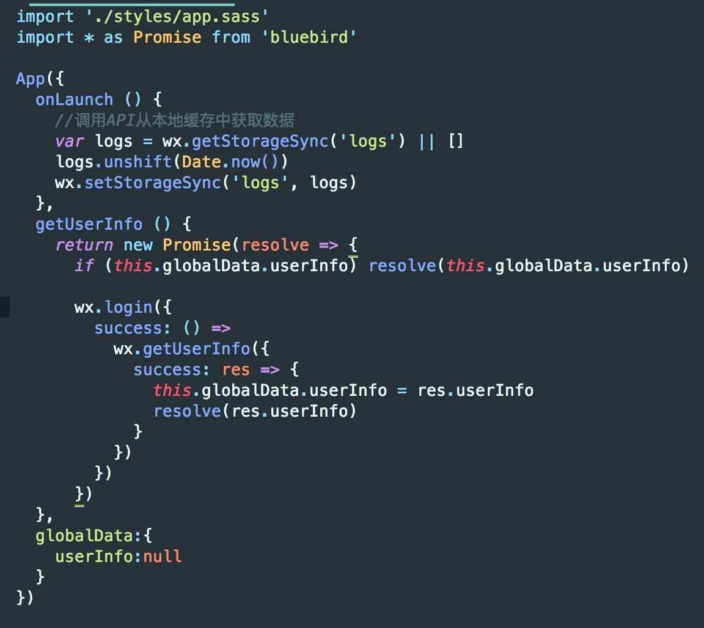
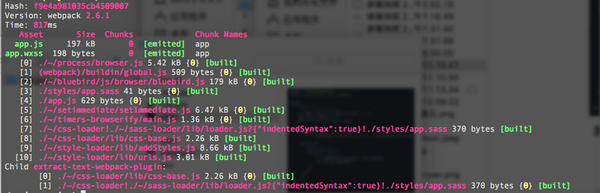

## 引入 app.sass

webpack 的核心便是 `plugins`。其次就是 `loader`

### loader

loader 用于对模块的源代码进行转换。因此，loader 类似于 gulp 等构建工具中的`任务(task)`。loader 可以将样式文件转换为 js，然后再导出，或者将 es7 的代码转换为 es6 的代码等等等等。

### 配置


```bash
$ yarn add sass-loader node-sass css-loader style-loader extract-text-webpack-plugin
```

安装好了之后配置 webpack.config.js

```javascript
const { resolve } = require('path')
const r = url => resolve(__dirname, url)
const ExtractTextPlugin = require('extract-text-webpack-plugin')
const extractSass = new ExtractTextPlugin({
  filename: '[name].wxss'
}) 

module.exports = {
  entry: {
    app: r('./app.js')
  },
  output: {
    path: r('./dist'),
    filename: '[name].js'
  },
  module: {
    rules: [
      {
        test: /\.sass$/,
        use: extractSass.extract({
          use: [
            {
              loader: 'css-loader'
            },
            {
              loader: 'sass-loader',
              options: {
                indentedSyntax: true
              }
            },
          ],
          fallback: 'style-loader'
        })
      }
    ]
  },
  plugins: [
    extractSass
  ]
}
```

这里我们引入 sass-loader 来解析当 app.js 中遇到引入扩展名为 `.sass` 时候的文件，并且利用 css-loader 和 style-loader 进一步解析，最终利用 `extract-text-webpack-plugin` 插件将最终生成相应的 `.wxss` 文件

### 新建样式文件

我们在项目根目录下新建一个文件夹 styles ，在其中先新建 app.sass 文件
```sass
.container 
  height: 100%
  display: flex
  flex-direction: column
  align-items: center
  justify-content: space-between
  padding: 200rpx 0
  box-sizing: border-box
  background: #eee
```
并在 app.js 中添加一句
```
import './styles/app.sass'

```


执行 build
```
$ webpack
```

<br>
成功之后我们可以看到 webpack 输出这样的信息



看到 app.wxss 198 b 表示我们已经成功了，这时候切换到小程序开发者工具就可以看到背景颜色变成灰色的了（如果没有就刷新）。
