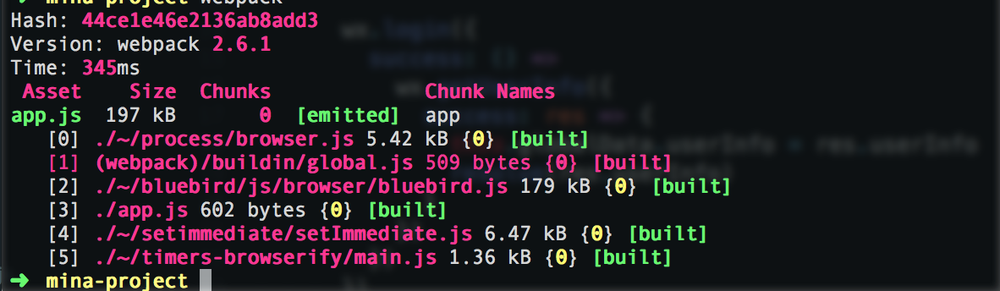

## webpack 显示的信息



这里第一条显示的是最终生成的 app.js 大小 197kb，
下面的是 webpack 解析依赖关系之后提取所有的模块，并且引入的位置

- 模块0 node_modules/process/browser.js
- 模块1 node_modules/webpack/buildin/global.js
- 模块2 node_modules/bluebird/js/browser/bluebird.js
- 模块3 app.js 也就是我们编写的 app.js
- 模块4 node_modules/setimmediate/setImmediate.js
- 模块5 node_modules/timers-browserify/main.js

## 剖析 app.js

我们先用几分钟来看下这个`自执行匿名函数`

```javascript

(function (modules) {

  function require(id) {
    const module = { exports: {} }
    const installedModules = {}

    if (installedModules[id]) {
       return installedModules[id].exports
    }

    modules[id].call(module.exports, module.exports, module, require)

    return module.exports
  }

  return require(3)
}([
  /* 模块0 */
  (function (exports, module, require) {
    /* app.js 中的内容*/
  }),
  /* 模块1 */
  (function (exports, module, require) {
    var someFunction = function () {}
    module.exports = someFunction
  }),
  /* 模块2 */
  (function (exports, module, require) {
    var someFunction = function () {}
    module.exports = someFunction
  }),
  /* app.js */
  (function (exports, module, require) {
    var Promise = require(2)
    App({
    ...
    ...
    })
  }),
  /* 模块4 */
  (function (exports, module, require) {
    var someFunction = function () {}
    module.exports = someFunction
  }),
  /* 模块5 */
  (function (exports, module, require) {
    var someFunction = function () {}
    module.exports = someFunction
  })
]))
```

这便是 webpack 打包生成的文件。在解析到模块间的相互依赖关系之后，巧妙的用一个 require 方法来实现模块间的引用的问题。而且利用闭包的特性，解决命名空间冲突的问题。


